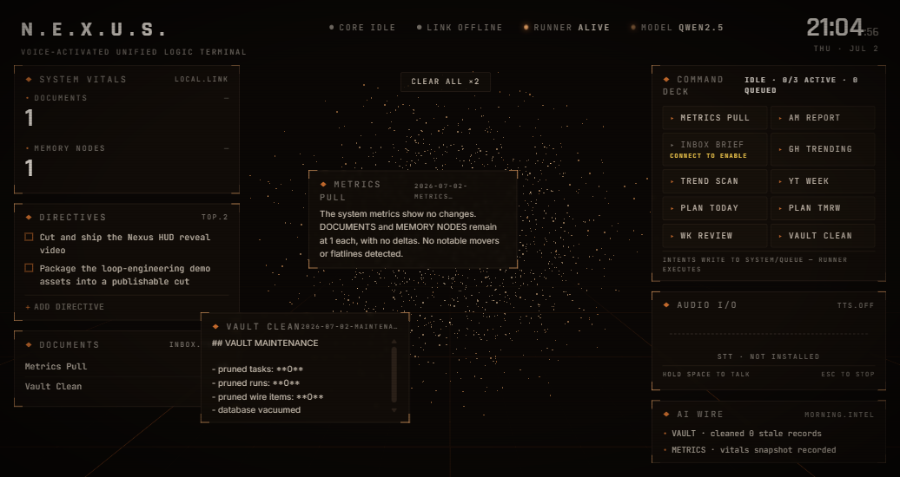
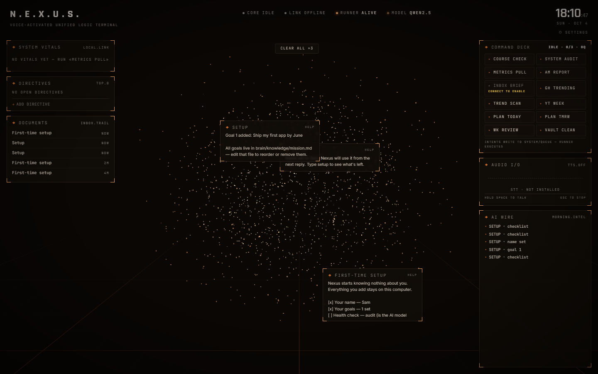

# N.E.X.U.S.

**Voice-activated unified logic terminal** — a local-first, offline-capable, 100%-free personal AI operations center.



Speak or click an **intent** → a background **Runner** orchestrates local AI **agents** that call **tools** (local LLM, memory, filesystem, and optional Notion/Calendar/Email) → results stream back into a cinematic amber-on-near-black HUD as framed cards, live vitals, a streaming intel wire, and a persisted document trail.

> **Intents write to a queue → the Runner executes → results render and persist.**

## Your data stays yours

- **It starts empty.** A fresh install knows no name, no goals, no subjects and no plans. You make it yours in a
  minute with `setup` (Ctrl+K → `setup name Sam` → `setup goal Ship my first app by June`).
- **Everything you add lives in one folder on your own computer** (`~/.nexus`: database, documents, memories) —
  never in this repository, never uploaded. Delete the folder and it's a factory reset.
- **Nobody else can reach it.** The Runner listens only on `127.0.0.1` and every request needs a random key that only
  your HUD knows. No accounts, no telemetry, no phone-home.



## The brain (v0.3)

Nexus has a persistent identity and memory, all local and $0:

- **Living identity** — `~/.nexus/brain/identity.md`, plain prose; edits
  apply on the very next reply, no restart
- **Core knowledge** — `brain/knowledge/*.md`, always loaded, never re-asked
- **Two-block prompt** — the byte-stable brain prefix rides every agent turn
  (Ollama prefix-cache friendly); a fresh time/checkpoint block closes it
- **Conversations** — palette free-text is a session that survives restarts
  (`session`, `session new`, `session resume <id>`)
- **Long-term memory** — one markdown file per fact with a typed hook + body;
  saved deliberately (its `brain.save` tool / your `brain save …`) and by an
  end-of-session extractor — every write passes Zod → red-line → dedupe gates
  in code; only a typed human command can delete
- **Recall** — semantic via free local `nomic-embed-text`, keyword fallback,
  index always rebuildable from the files (`brain reindex`)

See **[docs/BRAIN.md](docs/BRAIN.md)**.

## Life tracking (v0.2)

Nexus tracks the operator's life in structured SQLite via **typed commands**
(Ctrl+K, type `help`) that are parsed by code — **no AI on any write path**,
so everything works even with the model offline:

- **Courses** — progress + automatic staleness nags
- **Email/reminders** — Gmail *drafts* and Calendar events, always confirm-gated
- **`audit`** — deterministic PASS/WARN/FAIL self-check with remedies
- **Optional modules** (off until you turn them on with `modules on <name>`):
  - `academics` — CAIE A Levels: past papers, syllabus chapters, mechanical strength scores, exam countdown,
    `revise` picks (9702 Physics · 9709 Maths · 9618 CS)
  - `scholarships` — daily keyword-filtered sweep of free undergraduate-scholarship feeds, deduped
  - `agency` — freelance pipeline: leads → clients → projects → payments

**Read [docs/OPERATING.md](docs/OPERATING.md) to use it and
[docs/MAINTENANCE.md](docs/MAINTENANCE.md) to fix it.**

## The 100%-Free Guarantee

Nexus is fully usable by a person who spends **$0** and is **completely offline**:

- **No paid APIs, no subscriptions, no cloud accounts, no API keys** required for the core app.
- Thinking: **Ollama** (local LLM). Speech: **whisper.cpp** (STT) + **Piper** (TTS). Storage: **SQLite + sqlite-vec**. All free, all local.
- Integrations (Notion, Google Calendar, Gmail, IMAP, CalDAV) are **optional** and free-tier only. The app is fully functional with all of them disconnected.
- **No telemetry, no analytics, no phone-home.**

## Quick start (no Rust needed)

Needs [Bun](https://bun.sh) (free). Step-by-step for non-developers: **[docs/first-run.md](docs/first-run.md)**.

```sh
git clone https://github.com/haidermoulay3mk/nexus.git
cd nexus
bun install
bun run dev:web        # boots the Runner + HUD at http://localhost:1420 (Windows: double-click Start Nexus.cmd)
```

Install [Ollama](https://ollama.com/download) (free) and pull models:

```sh
ollama pull llama3.2:3b                  # chat (or qwen2.5:7b-instruct-q4_K_M with 16 GB+ RAM)
ollama pull nomic-embed-text             # embeddings for semantic memory
```

Nexus auto-detects your hardware (Model Tier + Visual Tier) and adopts whatever compatible chat model you already have pulled — it never forces a multi-GB download.

Then press **Ctrl+K** and type `setup` — it walks you through telling Nexus your name and goals, and which optional
modules to turn on.

## Commands

| Command | What |
|---|---|
| `bun run dev:web` | Runner + HUD in a browser (no shell) |
| `bun run dev:runner` / `dev:ui` | Each half separately |
| `bun test packages plugins` | Full offline test suite (93 tests, mocked Ollama) |
| `bun run lint` | Biome lint + format check |
| `bun run typecheck` | Strict TS across all workspaces |
| `bun run build:runner` | Compile the Runner to a single sidecar exe |
| `cd apps/shell/src-tauri && cargo tauri build` | Package the desktop app (needs Rust) |

## Layout

```
apps/shell      Tauri 2 shell (Rust): tray, global push-to-talk, Stronghold, sidecar supervision
apps/ui         React 19 HUD: R3F nebula, corner-bracket panels, command deck, AI wire
packages/core   Shared Zod contracts (events, DTOs, intents)
packages/db     SQLite + sqlite-vec + Drizzle (WAL; Runner is sole writer)
packages/runner Bun sidecar: orchestrator, agents, tools, queue, scheduler, memory, voice, WS bus, command router
packages/plugin-sdk  The typed NexusPlugin interface (+ RecordsApi, CommandSpec)
plugins/        First-party plugins: academics, scholarships, courses, agency, ops,
                metrics, reports, intel, calendar, email, notion
docs/           Operating manual, maintenance runbook, architecture, plugin SDK, first-run
```

See [docs/architecture.md](docs/architecture.md), [docs/plugin-sdk.md](docs/plugin-sdk.md), [docs/first-run.md](docs/first-run.md).

## License

MIT. Fonts (Rajdhani, JetBrains Mono, Inter) are bundled under the SIL Open Font License.

## History

NEXUS began life as **Jarvis** — a double-clap desk assistant — and went through a Python "personal AI OS", a
voice-first core and a single-file web app before becoming this TypeScript version. Every generation is preserved in
[`archive/`](archive/README.md).
